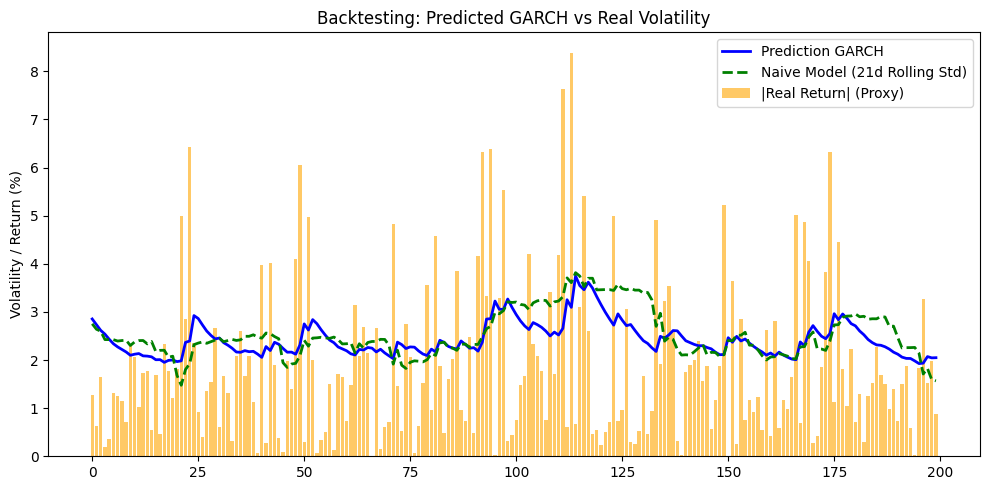

# Conditional Volatility Forecasting using GARCH Models

## 📌 Project Overview
This project demonstrates the application of Generalized Autoregressive Conditional Heteroskedasticity (GARCH) models to forecast the daily volatility of financial time series. Specifically, it analyzes the stock returns of **Leonardo S.p.A. (LDO.MI)**. 

The main objective is to establish whether a mathematical model designed to capture volatility clustering (ARCH effects) and heavy tails (leptokurtosis) can provide a statistically significant improvement in forecasting accuracy compared to standard industry baselines.

## ⚙️ Methodology & Approach
The analysis pipeline follows standard financial econometrics practices:

1. **Data Acquisition & Preprocessing:**
   * Daily stock prices are fetched using `yfinance`.
   * Logarithmic returns are calculated to ensure time-additivity and stationarity.
2. **Assumption Validation:**
   * Squared returns are computed, and Auto-Correlation Function (ACF) and Partial Auto-Correlation Function (PACF) plots are generated to confirm the presence of volatility clustering.
3. **Model Selection & Specification:**
   * A **GARCH(1,1)** model is selected as the primary forecasting engine.
   * A **Student's t-distribution** (`dist="t"`) is specified to account for the heavy-tailed nature typical of financial returns.
4. **Backtesting (Rolling Window Forecast):**
   * The model is evaluated using a daily expanding rolling window approach over a test set. This simulates real-world conditions and prevents look-ahead bias (data leakage).
5. **Model Evaluation:**
   * Due to the lack of high-frequency intraday data, **absolute returns** ($|r_t|$) are used as the proxy for true realized volatility.
   * The GARCH(1,1) predictions are compared against a **Naive Baseline Model** (21-day rolling historical standard deviation) using MAE and RMSE metrics.

## 📊 Results & Conclusion

To evaluate the predictive power of our model, the GARCH(1,1) forecasts were compared against the naive baseline. 

| Metric | GARCH(1,1) | Naive Model (21d) |
| :--- | :---: | :---: |
| **MAE** | 1.4298 | 1.5103 |
| **RMSE** | 1.7317 | 1.8080 |

*(Note: Lower values indicate better forecasting accuracy).*

### Key Takeaways:

* **Consistent Outperformance:** The GARCH(1,1) model successfully outperforms the naive baseline across both error metrics. This confirms that modeling the conditional variance mathematically provides a tangible predictive advantage over simple historical averages.
* **Handling Volatility Spikes:** The reduction in RMSE is particularly relevant. Since RMSE penalizes larger prediction errors more heavily, this lower value indicates that the GARCH model is significantly better at adapting to sudden volatility shocks than the lagging 21-day rolling window.
* **Practical Value:** In financial econometrics, even seemingly small reductions in forecasting error are highly valuable. In real-world applications—such as Value at Risk (VaR) estimation or options pricing—this added precision translates into more accurate risk management.

## 🛠️ Technologies Used
* **Python 3**
* `pandas` & `numpy` (Data manipulation)
* `yfinance` (Data acquisition)
* `arch` (GARCH modeling)
* `statsmodels` (ACF/PACF plots)
* `scikit-learn` (Evaluation metrics)
* `matplotlib` (Data visualization)

## 🚀 How to Run
1. Clone this repository.
2. Install the required dependencies (e.g., `pip install pandas yfinance arch statsmodels scikit-learn matplotlib`).
3. Run the Jupyter Notebook `GARCH_volatility.ipynb`.
